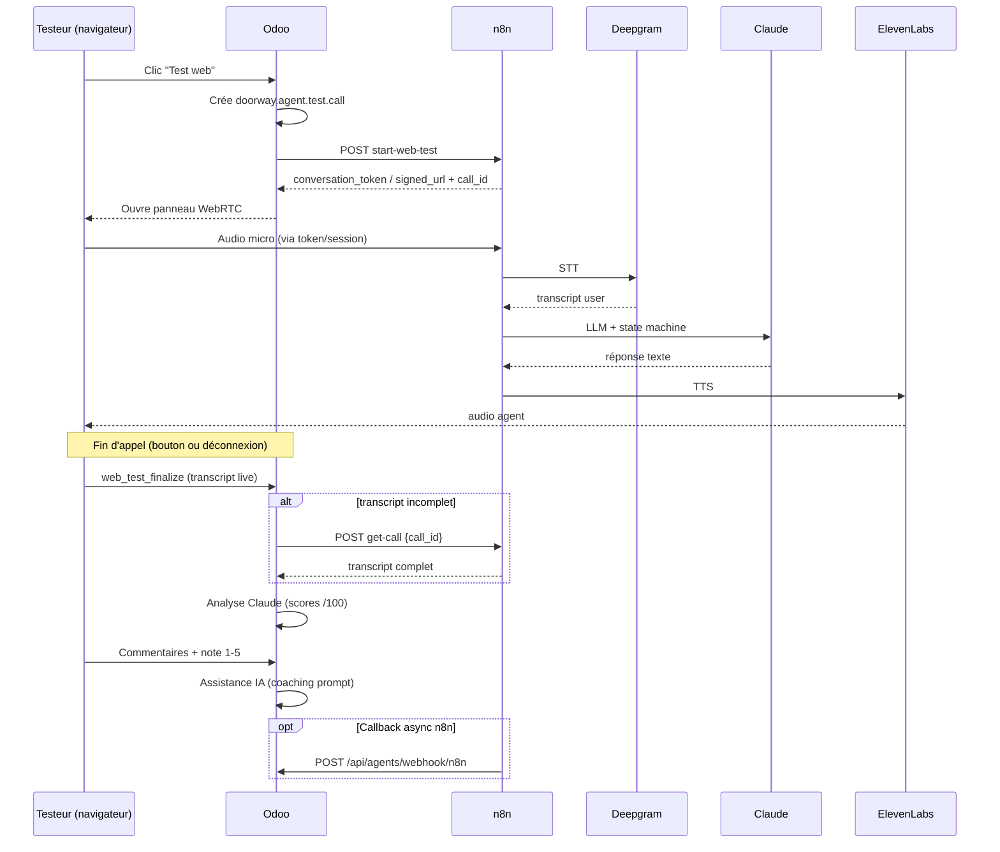

# Contrat webhook n8n — Test agent web (`start-web-test`)

Stack cible **inchangée** :

```
Navigateur (micro) → n8n → Deepgram (STT) → Claude (LLM) → ElevenLabs (TTS) → navigateur
                              ↓ fin de session
                    Odoo (transcript + scores + retours utilisateur + coaching Claude)
```

Ce document décrit le contrat entre **Odoo** (`doorway_agents_dashboard`) et **n8n** pour le test agent en appel web (sans téléphone).

---

## 1. Configuration Odoo

```ini
# /etc/odoo-server.conf ou variables env
N8N_BASE_URL=https://n8n.intellixcrm.com
N8N_API_TOKEN=<bearer_token>
N8N_START_WEB_TEST_PATH=/webhook/doorway/agents/start-web-test
N8N_GET_CALL_PATH=/webhook/doorway/agents/get-call
DOORWAY_AGENTS_WEBHOOK_KEY=<clé_hex_32>
```

Paramètre ICP optionnel : `doorway_agents_dashboard.n8n_start_web_test_path`

---

## 2. `POST start-web-test` — Démarrer une session web

### Requête (Odoo → n8n)

| Élément | Valeur |
|---------|--------|
| **URL** | `{N8N_BASE_URL}{N8N_START_WEB_TEST_PATH}` |
| **Méthode** | `POST` |
| **Headers** | `Content-Type: application/json` |
| | `Authorization: Bearer {N8N_API_TOKEN}` |
| **Timeout Odoo** | 25 s |

#### Body JSON

```json
{
  "source": "odoo",
  "mode": "browser_mic",
  "stack": "n8n+deepgram+claude+elevenlabs",
  "agent_id": "sofia_renov_j0",
  "agent_profile_id": 42,
  "pipeline": "renovation",
  "volet": "qualification",
  "scenario_hint": "Lead thermopompe urgent, budget 15 000 $, Laval",
  "test_call_id": 1287,
  "dynamic_variables": {
    "lead_name": "Jean Test Odoo",
    "lead_city": "Québec",
    "lead_id_odoo": "TEST-1287"
  },
  "actions": {
    "send_email": false,
    "send_sms": false,
    "availability_check": false,
    "human_transfer": false
  },
  "expected_action_result": "SMS de confirmation + transfert conseiller"
}
```

#### Champs

| Champ | Type | Obligatoire | Description |
|-------|------|-------------|-------------|
| `source` | string | oui | Toujours `"odoo"` |
| `mode` | string | oui | Toujours `"browser_mic"` pour ce webhook |
| `stack` | string | oui | `"n8n+deepgram+claude+elevenlabs"` |
| `agent_id` | string | oui | ID stable agent côté n8n / campagne |
| `agent_profile_id` | int | oui | ID `doorway.agent.profile` Odoo |
| `pipeline` | string | oui | `renovation`, `immobilier`, `marketing`, etc. |
| `volet` | string | non | `reception`, `qualification`, `cold_call` |
| `scenario_hint` | string | non | Contexte libre pour le test |
| `test_call_id` | int | oui | ID `doorway.agent.test.call` — **à conserver pour callbacks** |
| `dynamic_variables` | object | non | Variables lead (même logique que `start-call`) |
| `actions` | object | non | Flags test actions automatisées |
| `expected_action_result` | string | non | Résultat attendu par le testeur |

> **Note :** contrairement à `start-call`, il n’y a **pas** de `to_number` / `from_number`.

---

### Réponse (n8n → Odoo)

**HTTP 200** avec JSON. Au moins **un** des champs de connexion ci-dessous est **obligatoire**.

#### Option A — WebRTC ElevenLabs (recommandé si n8n proxifie le token)

n8n génère le token **sans exposer la clé API** au navigateur :

```json
{
  "conversation_token": "eyJhbGciOiJIUzI1NiIs...",
  "session_id": "sess_abc123",
  "call_id": "sess_abc123"
}
```

#### Option B — Signed URL WebSocket

```json
{
  "signed_url": "wss://api.elevenlabs.io/v1/convai/conversation?...",
  "conversation_id": "conv_xyz",
  "call_id": "conv_xyz"
}
```

#### Option C — WebSocket custom n8n (stack Deepgram+Claude+EL native)

Si le workflow expose **votre** passerelle audio (sans ConvAI natif) :

```json
{
  "websocket_url": "wss://n8n.intellixcrm.com/ws/agent-test/sess_abc123",
  "session_id": "sess_abc123",
  "call_id": "sess_abc123"
}
```

Protocole WebSocket : à documenter dans le workflow n8n (messages `audio_chunk`, `transcript`, `agent_reply`, `end`).

#### Option D — Page hébergée n8n

```json
{
  "session_url": "https://n8n.intellixcrm.com/webhook/agent-test-ui?sess=abc123",
  "session_id": "sess_abc123",
  "call_id": "sess_abc123"
}
```

> Odoo v19.0.3.28 utilise aujourd’hui **Option A ou B** via le SDK `@elevenlabs/client` dans le navigateur.  
> **Option C** nécessite une évolution OWL (connexion WebSocket custom).  
> **Option D** ouvre une UI externe (hors scope actuel Odoo).

#### Champs réponse

| Champ | Type | Obligatoire | Usage Odoo |
|-------|------|-------------|------------|
| `conversation_token` | string | * | Passé au SDK ElevenLabs `startSession` |
| `signed_url` | string | * | Alternative à `conversation_token` |
| `websocket_url` | string | * | Réservé stack n8n custom |
| `session_url` | string | * | UI externe |
| `call_id` | string | recommandé | Stocké dans `doorway.agent.test.call.external_call_id` |
| `conversation_id` | string | alias | Accepté à la place de `call_id` |
| `session_id` | string | alias | Accepté à la place de `call_id` |

\* Au moins un parmi `conversation_token`, `signed_url`, `websocket_url`, `session_url`.

#### Erreur

```json
{
  "error": "Agent inconnu",
  "message": "agent_id sofia_renov_j0 introuvable dans n8n"
}
```

HTTP 4xx/5xx → Odoo affiche le message à l'utilisateur.

---

## 3. Flux complet



---

## 4. `POST get-call` — Récupérer transcript (existant)

Utilisé par Odoo si le transcript navigateur est vide à la fin du test.

| Élément | Valeur |
|---------|--------|
| **URL** | `{N8N_BASE_URL}{N8N_GET_CALL_PATH}` |
| **Body** | `{"source": "odoo", "call_id": "sess_abc123"}` |

#### Réponse attendue

```json
{
  "call_id": "sess_abc123",
  "duration_seconds": 94,
  "transcript": [
    {"role": "user", "content": "Bonjour, je voudrais une thermopompe"},
    {"role": "agent", "content": "Parfait, êtes-vous propriétaire ?"}
  ],
  "recording_url": "https://..."
}
```

Format alternatif accepté :

```json
{
  "transcript": "user: Bonjour\nagent: Parfait..."
}
```

---

## 5. Callback Odoo — Fin de session (optionnel mais recommandé)

Si n8n finalise la session côté serveur, notifier Odoo (même contrat que les appels téléphoniques).

| Élément | Valeur |
|---------|--------|
| **URL** | `https://intellixcrm.com/api/agents/webhook/n8n` |
| **Méthode** | `POST` |
| **Header** | `X-Doorway-Key: {DOORWAY_AGENTS_WEBHOOK_KEY}` |

#### Body

```json
{
  "call_id": "sess_abc123",
  "test_call_id": 1287,
  "duration_ms": 94000,
  "transcript": [
    {"role": "user", "content": "..."},
    {"role": "agent", "content": "..."}
  ],
  "recording_url": "https://..."
}
```

Odoo :
1. Retrouve `doorway.agent.test.call` via `external_call_id = call_id`
2. Lance l'analyse Claude (`call_analyzer`)
3. Met à jour scores et stats agent

> Si Odoo a déjà finalisé via `web_test_finalize`, le webhook peut être ignoré (idempotent sur `call_id`).

---

## 6. Exemple cURL — test manuel

### Démarrer session web

```bash
curl -sS -X POST "https://n8n.intellixcrm.com/webhook/doorway/agents/start-web-test" \
  -H "Content-Type: application/json" \
  -H "Authorization: Bearer $N8N_API_TOKEN" \
  -d '{
    "source": "odoo",
    "mode": "browser_mic",
    "stack": "n8n+deepgram+claude+elevenlabs",
    "agent_id": "sofia_renov_j0",
    "agent_profile_id": 42,
    "pipeline": "renovation",
    "volet": "qualification",
    "test_call_id": 9999,
    "scenario_hint": "Test manuel curl"
  }'
```

### Récupérer transcript

```bash
curl -sS -X POST "https://n8n.intellixcrm.com/webhook/doorway/agents/get-call" \
  -H "Content-Type: application/json" \
  -H "Authorization: Bearer $N8N_API_TOKEN" \
  -d '{"source": "odoo", "call_id": "sess_abc123"}'
```

### Notifier fin à Odoo

```bash
curl -sS -X POST "https://intellixcrm.com/api/agents/webhook/n8n" \
  -H "Content-Type: application/json" \
  -H "X-Doorway-Key: $DOORWAY_AGENTS_WEBHOOK_KEY" \
  -d '{
    "call_id": "sess_abc123",
    "duration_ms": 60000,
    "transcript": [
      {"role": "user", "content": "Bonjour"},
      {"role": "agent", "content": "Bonjour, comment puis-je vous aider ?"}
    ]
  }'
```

---

## 7. Recommandations implémentation n8n

### Workflow minimal `start-web-test`

1. **Webhook** `POST /webhook/doorway/agents/start-web-test`
2. **Valider** `agent_id` + charger config agent (prompt, voix, state machine)
3. **Créer session** en base n8n / Redis : `session_id`, `test_call_id`, `agent_profile_id`
4. **Brancher la stack** :
   - Entrée audio navigateur → **Deepgram** streaming STT
   - Texte user → **Claude Haiku** (même nœud que `03_conversation_engine.json`)
   - Réponse → **ElevenLabs TTS** (même `utils_elevenlabs_tts.json`)
5. **Retourner** `conversation_token` ou `signed_url` + `call_id` (= `session_id`)

### Ce qu'il ne faut pas faire

- Ne pas appeler ElevenLabs ConvAI **directement** en bypassant Claude/Deepgram pour les agents `provider=n8n`
- Ne pas exposer `ELEVENLABS_API_KEY` ou `ANTHROPIC_API_KEY` au navigateur
- Ne pas réutiliser `start-call` (Twilio) pour le mode web

### Alignement avec `start-call`

| Champ | `start-call` (téléphone) | `start-web-test` (navigateur) |
|-------|--------------------------|-------------------------------|
| `to_number` | oui | non |
| `from_number` | oui | non |
| `mode` | absent | `"browser_mic"` |
| `stack` | absent | `"n8n+deepgram+claude+elevenlabs"` |
| Réponse | `call_id` Twilio | `conversation_token` / `signed_url` |

---

## 8. Références code Odoo

| Fichier | Rôle |
|---------|------|
| `services/n8n_client.py` | `start_web_test()`, `fetch_call()` |
| `models/agent_test_call.py` | `web_test_prepare()`, `web_test_finalize()` |
| `static/src/js/agent_web_call.js` | UI test web + feedback |
| `controllers/webhook_calls.py` | `POST /api/agents/webhook/n8n` |
| `config.env.example` | Variables `N8N_*` |

Version module : **19.0.3.28+**
